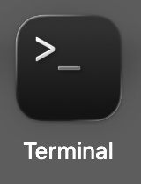
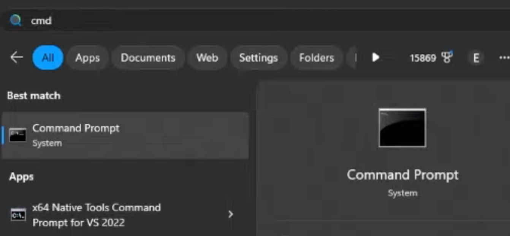

# Installations

The first step is to install all the appropriate software to get our environment together. Please install the following on the computer you intend to complete all the tutorials from.

*Note*: while VS code is an application, the other softwares are installed via your terminal or bash. If this is your first time working with your terminal, check out [working with your terminal](#Working-with-your-terminal). 

- [VS Code](https://code.visualstudio.com/) - free code editor and IDE (our recommendation). This is an application to view files and code. This application also includes many handy extensions that can help us with [version control](https://code.visualstudio.com/docs/editor/versioncontrol#_git-support) and [file serving](https://marketplace.visualstudio.com/items?itemName=ritwickdey.LiveServer).
    - You may also use another code editor that has AI integration, like [cursor](https://cursor.com/), but these ai integrations typically require payment after reacting an interaction limit. 
- [Git](https://git-scm.com/book/en/v2/Getting-Started-Installing-Git) version control software. You will also need an account on [Github.com](https://github.com/).
    - all installation details are included in the [Getting Started Installing Git link](https://git-scm.com/book/en/v2/Getting-Started-Installing-Git).
    - if you have a mac, and you have installed Xcode, you _already have git_. You can test this by opening your terminal and running `git --version`.
    - if you are using a PC, an application called "git bash" will be part of the default git install. You may prefere to use this application rather than the "command prompt" for git commands.
    - an alternative for both mac and pc is to use the [source control](https://code.visualstudio.com/docs/editor/versioncontrol#_git-support) options that come with the default VS Code installation. This is often easier than opening terminal each time and offers many of the same actions.
- [Node](https://nodejs.org/en/download/) - javascript development software. You can check if the install was succesful by running `node -v` in your command line or terminal. It should return your version number.

# Appendix

## Working with your terminal

Your computer, mac or pc, includes a command line interface that lets you communicate with your operating system. For macs, that app is called "terminal", and on windows machines, its the "command prompt". 

More resources to understand these interfaces: 
* Mac: [What is terminal on mac?](https://support.apple.com/guide/terminal/what-is-terminal-trmld4c92d55/mac)
* PC: [cmd.exe Wiki](https://en.wikipedia.org/wiki/Cmd.exe)
* PC: [Command Prompt Basics (youtube tutorial)](https://www.youtube.com/watch?v=QBWX_4ho8D4)
* [Complete List: Command Line Prompt (CMD)](https://www.codecademy.com/article/command-line-commands)

## Helpful terminal commands for navigation

### Windows Command Prompt (CMD)

- `dir`: List files and folders in current directory
- `cd [folder]`: Change directory (e.g., cd Documents)
- `cd ..`: Go up one directory level
- `cd \`: Go to root directory
- `mkdir [name]`: Create new folder
- `rmdir [name]`: Remove empty folder
- `del [filename]`: Delete file
- `copy [source] [destination]`: Copy files
- `move [source] [destination]`: Move/rename files

### macOS/Linux Terminal

- `ls`: List files and folders (ls -la for detailed view)
- `cd [folder]`: Change directory
- `cd ..`: Go up one directory
- `cd ~`: Go to home directory
- `pwd`: Show current directory path
- `mkdir [name]`: Create folder
- `rmdir [name]`: Remove empty folder
- `rm [filename]`: Delete file (rm -r [folder] for folders)
- `cp [source] [destination]`: Copy files
- `mv [source] [destination]`: Move/rename files