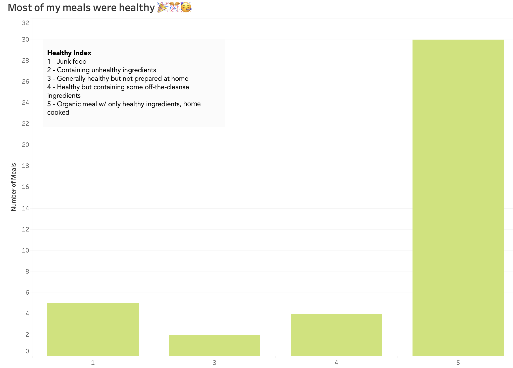
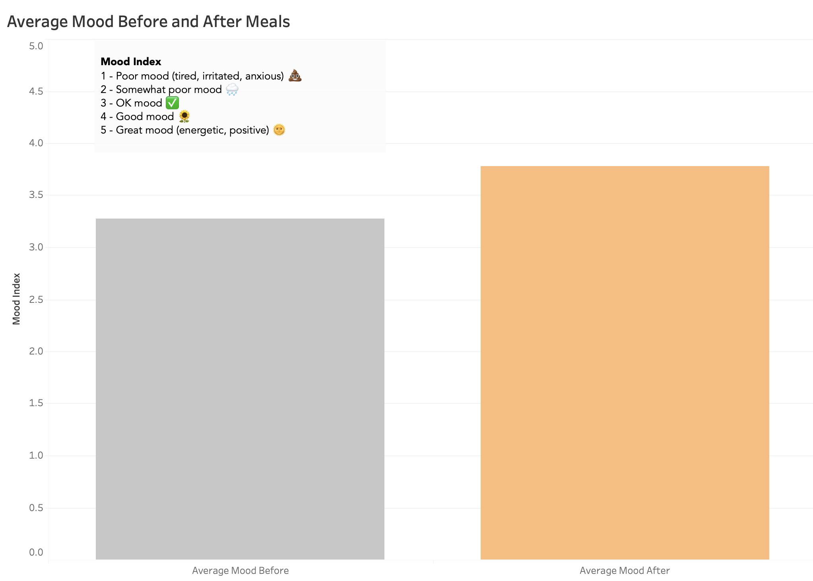

<!-- <style>
body { 
    font-family: 'Open Sans', 'Arial', sans-serif; 
}
h1, h2, h3, h4, h5, h6 { 
    font-family: 'Open Sans', 'Arial', sans-serif; 
}
</style> -->

# <span style="color: green;">LAB 0</span> <br/><span style="font-size: 14px;"> _Boryana's baby steps on planet IDV 🪐_

<br><br>

<span style="font-size: 24px;">Tracking and Understanding My dietary patterns</span>

**Dataset and Variables**

I started collecting diet data on 3/22/2025 and continued recording until 4/2/2025. During that period, I managed to log every single meal and ended up collecting 41 observations in total. I created a spreadsheet and, for the sake of accuracy, logged my meals as soon as possible after I was finished eating. I also had a backup notepad, where I was recording meals while on the go, and copied the observations to the spreadsheet on the next day. That was extremely helpful, as I noticed that I would forget meal times and details after a day of not logging. 

<br><br>

I’ve tracked the following variables, which represent the columns in my dataset:

1. Timestamp
2. Type of Meal (breakfast, lunch, dinner, snack)
3. Healthy Index (on a scale of 1-5)
4. Main Meal Ingredient (e.g. rice, potatoes, quinoa, etc.)
5. Home-cooked (dummy variable – Yes/No)
6. Alcohol Consumption (dummy variable – Yes/No)
7. Location (home, office, dine out)
8. On Time (dummy variable – Yes/No)
9. Mood Before (on a scale of 1-5)
10. Mood After (on a scale of 1-5)
11. Mood Change (calculated variable I created = [Mood after] – [Mood before])

<br><br>

**Health Index**
| Rating | Description |
|--------|-------------|
| 1 | Junk food |
| 2 | Containing unhealthy ingredients (refined sugar, fried stuff, etc) |
| 3 | Generally healthy but not prepared at home |
| 4 | Healthy but containing a limited number of off-the-cleanse ingredients |
| 5 | 100% Organic meal containing only healthy ingredients, prepared at home |

<br><br>



<br><br>

**Mood Index**

| Rating | Description |
|--------|-------------|
| 1 | Poor mood (tired, irritated, anxious) |
| 2 | Somewhat poor mood |
| 3 | OK mood |
| 4 | Good mood |
| 5 | Great mood (energetic, positive) |

<br><br>




```js
const food = view(
  Inputs.text({
    label: "Favorite Food",
    placeholder: "Enter your favorite food"
  })
);
```

```js
const selectMood = view(Inputs.select(
  [
    "Poor mood",
    "Somewhat poor mood",
    "OK mood",
    "Good mood",
    "Great mood"
  ],
  { label: "Mood", value: "OK mood" }  // default selection
));
```


